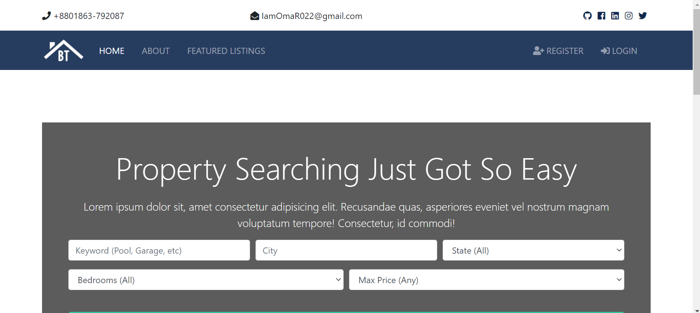
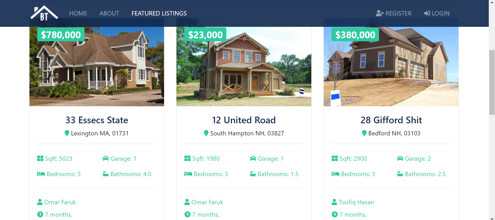
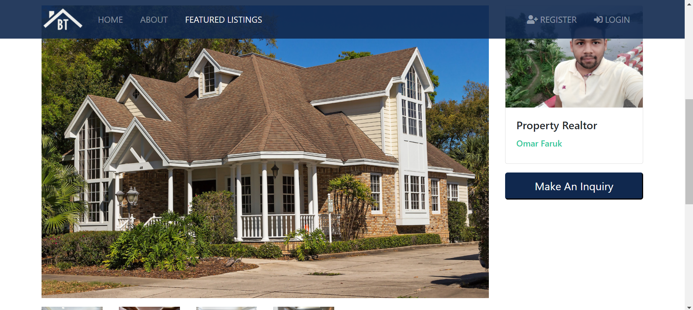
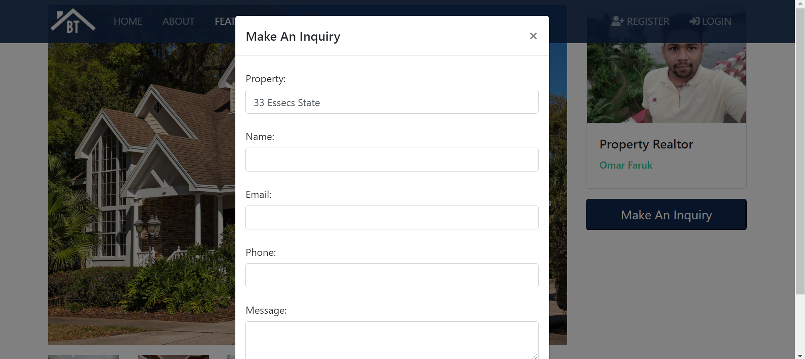
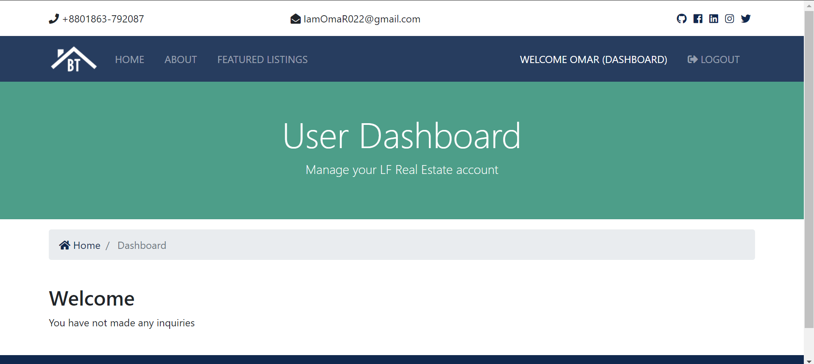

# Real-Estate-Project-Using-Django-PostgreSQL
*LF Real Estate is ready to make your real estate website faster, safer and better!*

# Features
* There are realtors
* There are best sellers
* You can by your house/flat
* You can sell your house/flat
* User-friendly.
<!--
**[Live Demo](https://iamomar22.pythonanywhere.com/)**
-->

# Tools
## Front-end Part
* HTML
* CSS
* Bootstrap
* JavaScript
* JQuery
## Back-end
* Django
* SQLite 3

# Screenshots of the Project

  
  
  
  
  

**Copyright ©** 2020-3020 Md. Omar Faruk

## Go Through This Site Then You Will Know About This Site Properly.
